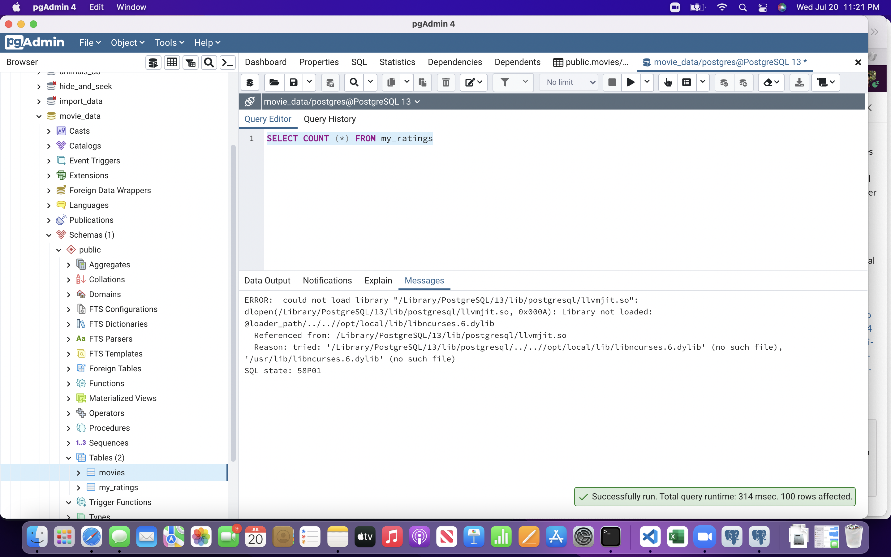
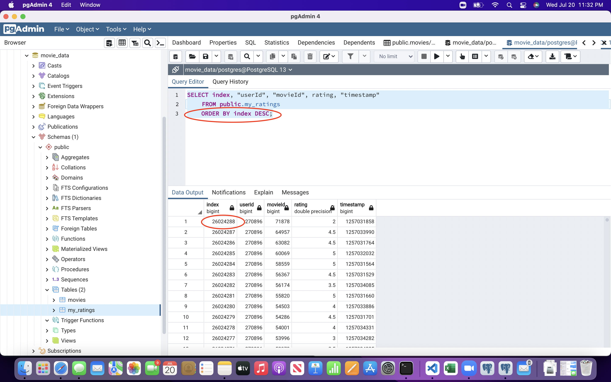
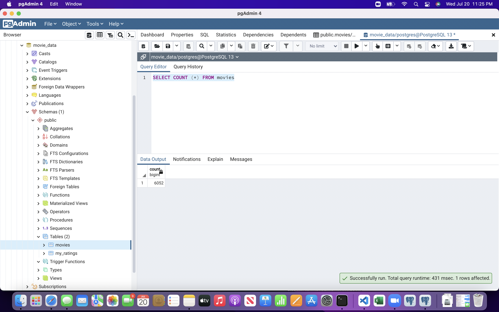

# Movies-ETL
# Results
Due to an error in PGadmin I was unable to view a row count for the table created from the ratings.csv file.
The error message received from the query “SELECT COUNT (*) FROM my_ratings” can be seen in the image ‘ratings_query_ERROR.png.’

Alternatively, to show the amount of movies in this data set I selected all table data, in descending order of ‘index.’ This shows that there are 26,024,288 rows of data, which would amount to 26,024,289 rows in total. 
The SQL code used to show this is the following:

“SELECT index, "userId", "movieId", rating, "timestamp"
	
  FROM public.my_ratings
	
  ORDER BY index DESC;”

The results of running this code can be seen in the image ‘ratings_query.png.’

Lastly, I was able to display the row count of the table “movies” by using the code “SELECT COUNT (*) FROM movies.” The results of this can be seen in the image ‘movies_query.png.’

